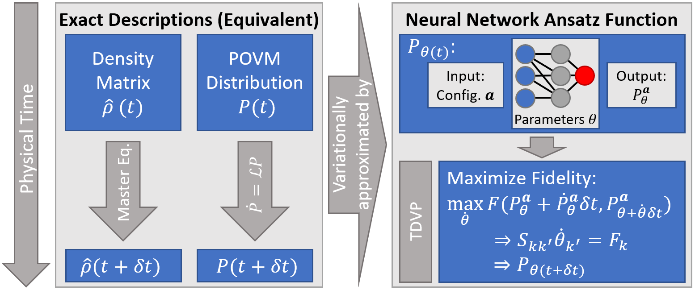
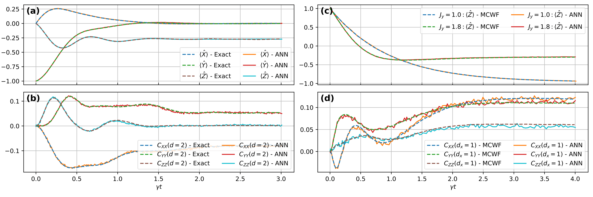
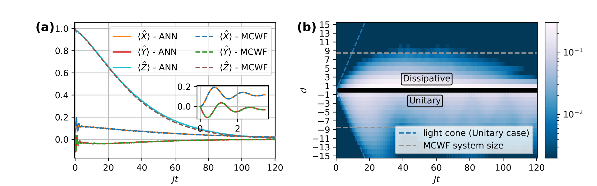

## Time-dependent variational principle for open quantum systems with artificial neural networks

#### Descriptions of Open Quantum Systems (OQS)

In a quantum mechanical description, the state of a system is either given by a wave function $\psi$ or the density matrix $\rho$. The simulation of the dynamics that such a system may undergo is a computationally challenging task. This is due to the fact that the number of equations of motion that need to be solved scales exponentially in the system size $N$.

This scaling is even worse for the density matrix compared to the wave function $\psi$, since its degrees of freedom are $4^N$ instead of $2^N$. This makes simulations of processes that require a density matrix formulation, e.g. irreversible quantum processes, extremely difficult.

At the same time one knows that the quantum state, for many applications of interest, is an object that has a lot of internal structure. This can be exploited to parameterize it efficiently. The question of what a good parameterization scheme is for this application has seen a lot of research in recent years, when it was discovered that Artificial Neural Networks (ANNs) present a suitable option.

#### How does the ANN encode a quantum state?
As density matrices may not be the ideal object to approximate using an ANN, we can 'translate' the density matrix into the POVM-formalism. Here, instead of a complex $2^N\times 2^N$ hermitian matrix we have $4^N$ probabilities $P^\textbf{a}=\mathrm{tr}(\rho M^\textbf{a})$ that describe the quantum state equally well, while allowing a probabilistic interpretation. This distribution over measurement outcomes is learned and encoded by the network.

The ANN can be viewed as an extremely complex non-linear function that maps input strings of measurement outcomes $\textbf{a}=a_1..a_N$ to probabilities, using on the order of a thousand or more variational parameters. If these probabilities are in the vicinity of the exact probabilities, we say that the quantum state is 'well approximated'. The important point is that we now only store the parameters describing the ANN instead of the exponentially many $P^\textbf{a}$.

#### Autoregressive networks and the RNN
One pressing question is what kind of network architecture is suited to encode these discrete probability distribution. One may observe that each probability $P(\textbf{a})$ can be partitioned in a product of conditionals,
$$
P(\textbf{a}) = P(a_1)\cdot P(a_2|a_1)\cdot..\cdot P(a_N|a_{N-1}..a_1).
$$
This is what is known as the autoregressive property, and we can implement its structure in the ANN-architecture using for example so-called 'Recurrent Neural Networks' (RNNs) which scan a cell parameterized by some parameters $\theta$ over the input string while storing information about previous contents of the string in a so-called 'hidden state'. The hidden state is a latent representation of physical contextual information and allows to encode physical correlations accurately in the model.

#### The Time-Dependent Variational Principle (TDVP)
The dynamics we wish to represent in the model are those generated by the Lindbladian master equation,
$$
\dot{\rho} = -i[H, \rho ] + \gamma\sum_i L^i \rho L^{i^\dagger} - \frac{1}{2} \left \lbrace L^{i^\dagger}L^i, \rho \right \rbrace.
$$
We limit our considerations to Hamiltonians that describe nearest neighbor interacting models with additional magnetic fields. The master equation in the POVM-formalism is given by the simple expression
$$
\dot{P}^\textbf{a} = \mathcal{L}^\textbf{ab}P^\textbf{b}
$$
Importantly, $\mathcal{L}$ is a sparse matrix meaning that for each $\textbf{a}$ only a linear number of indices $\mathbf{b}$ have entries that are nonzero.

The question we wish to then answer is the following: What is the update of the network parameters that optimally correspond to the update in the probabilities that are encoded by these very parameters?

The answer to this question is given by the TDVP-formalism. Here one compares, by means of a suitable distance measure, the known updates of the probabilities to the updates of probabilities that stem from a (yet unknown) parameter update $\dot{\theta}$. If one then aims to minimize this distance measure, i.e.
$$
0\stackrel{!}{=}\frac{\partial}{\partial \dot{\theta}}\mathcal{D}(P_{\theta(t)+\tau \dot{\theta}(t)},P_{\theta(t)}+\tau \mathcal{L}P_{\theta(t)})
$$
the well knwon TDVP-equation is obtained,
$$
S_{kk^\prime}\dot{\theta}_{k^\prime}=F_k.
$$

Importantly, for the right distance measures, such as the KL-divergence or the Hellinger distance, $S$ and $F$ can be estimated from samples and don't need to be evaluated for the exponential number of multi-indices $\textbf{a}$. $S$ is the Fisher-metric which incorporates information about the curvature of the variational manifold in the parameter update, while the Lindbladian operator $\mathcal{L}$ enters in $F$, such that it can be viewed as a force term driving the system according to the desired dynamics.

The above discussion is summarized in the figure below.

<!--  -->

*Fig. 1: The denstiy matrix and POVM-formalism in contrast to the variational approach based on the neural network whose paramters are dynamically adapted according to the TDVP.*

#### Dissipative quantum dynamics with the TDVP
To benchmark our system we looked at two toy model systems in 1D and 2D respectively. Both models are anisotropic Heisenberg models with different anisotropies, whose Hamiltonian is given by

$$H = \sum_{\langle ij \rangle} (J_x X_i X_j + J_y Y_i Y_j + J_z Z_i Z_j) + \sum_i h_z Z_i $$

where $\langle ij \rangle$ is the summation over nearest neighbours. In both cases the considered dissipation channel is a single-particle decay to spin down, i.e. $L=\sigma^-$.
The obtained results are shown in Fig. 2. Benchmark data is obtained with Exact Dynamics (ED) in the 1D case for a smaller system while we use the Monte Carlo Wave Function (MCWF) for the 4x4 lattice.

<!--  -->

*Fig. 2: (_a_) and (_b_): Mean magnetizations and next-nearest neighbour connected correlation functions in the anisotropic 1D Heisenberg model for $N=40$. (_c_) and (_d_): Mean $z$-magnetizations and nearest neighbour connected correlation functions in a $4\times 4$ anisotropic 2D Heisenberg lattice. Exact couplings and additional details can be found in the paper.*

Let us now turn to a physically motivated example: The dissipative dynamics of a confinement model. Confinement in many-body-dynamics refers to the finite length over which correlations between spins spread out if there exists an associated energy penalty for the alignment in a specific direction. Such a system is for example given by the Transverse Field Ising Model (TFIM) with additional longitudinal field

$$\hat H = \sum_{\langle ij\rangle}  J_z \hat Z_i \hat Z_j + \sum_i \left( h_z \hat Z_i + h_x \hat X_i \right).$$

The larger $h_z$ in the model, the more restricted the spreading becomes. If one now additionally considers the effects of dissipation, two different mechanism hinder the spreading of correlations, namely the dissipation and the energy penalty $h_z$. The complex resulting dynamics is shown in Fig. 3.

<!--  -->

*Fig. 3: (_a_) and (_b_): Mean magnetizations and suppressed spreading of correlations in a 32 spin chain with periodic boundary conditions that is subject to the above Hamiltonian and dephasing with rate $\gamma/J = 0.25$. The MCWF-benchmark data is obtained for a chain of 16 spins.*

Further reading: https://arxiv.org/pdf/2104.00013
